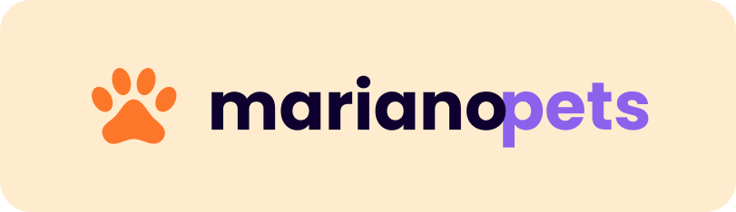
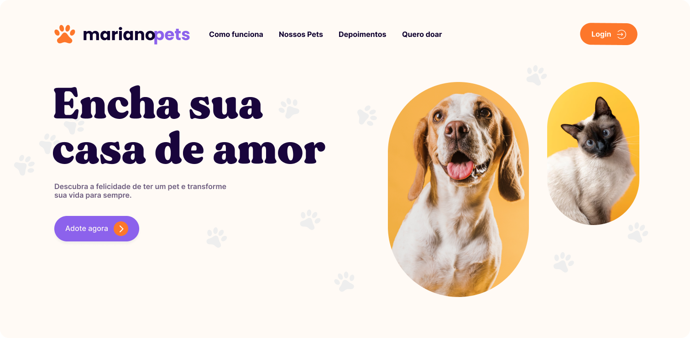
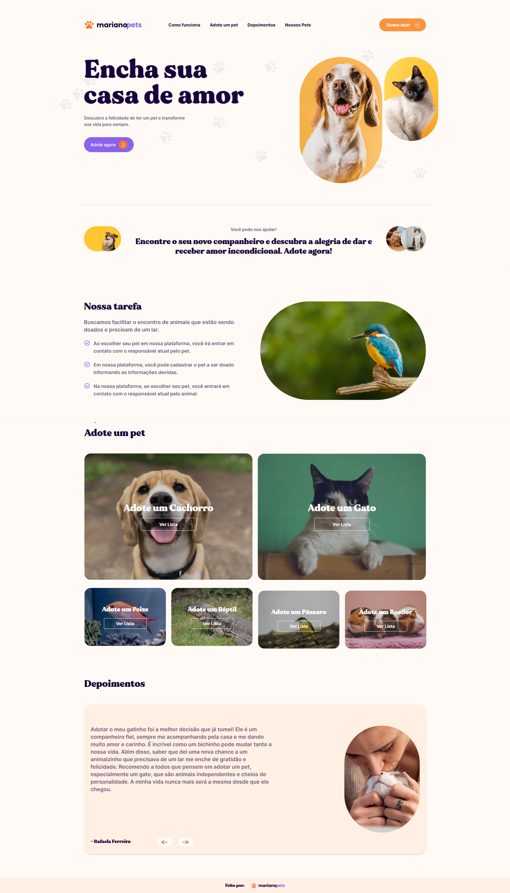
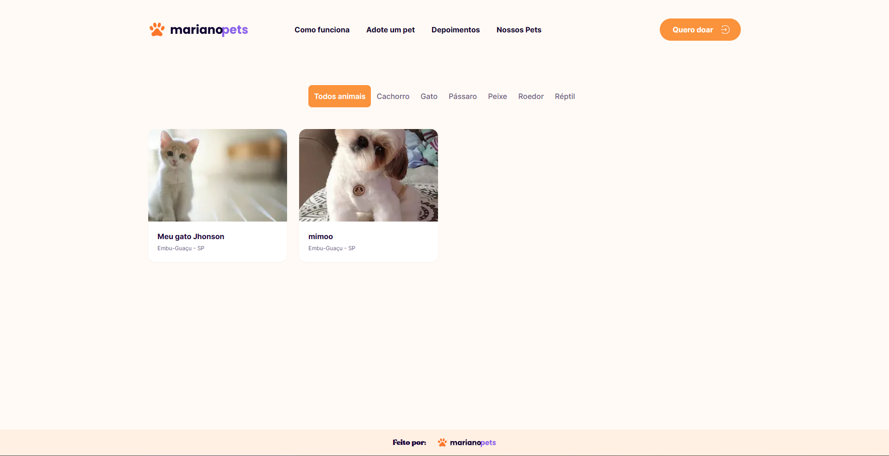
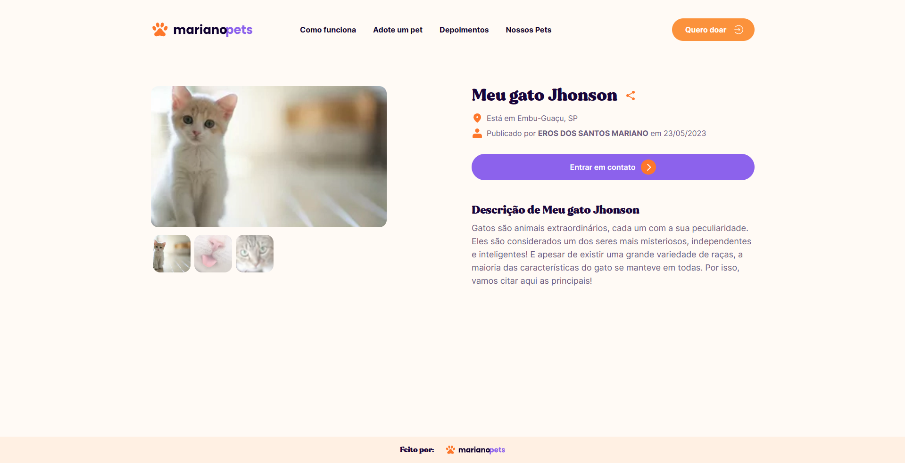
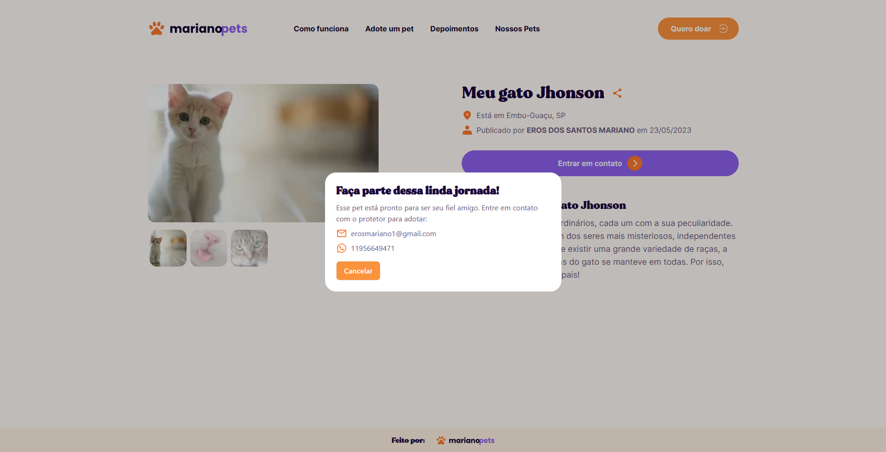
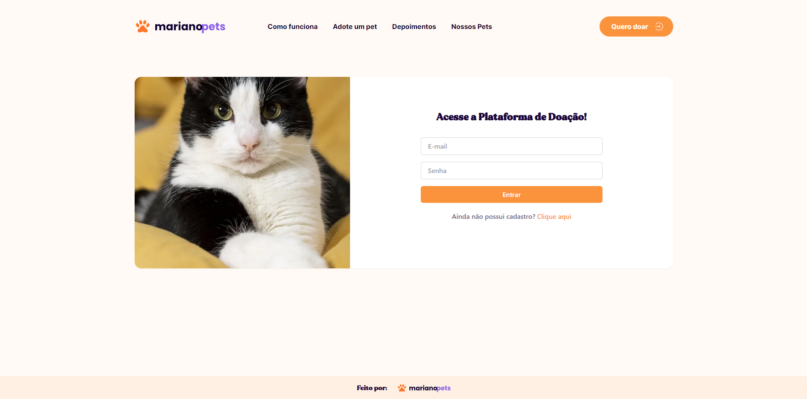
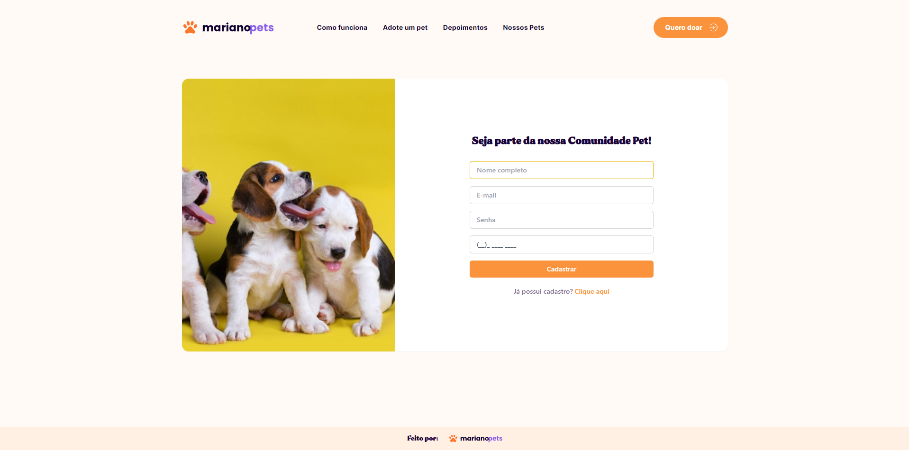
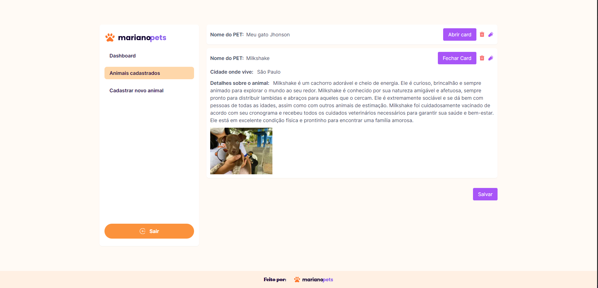
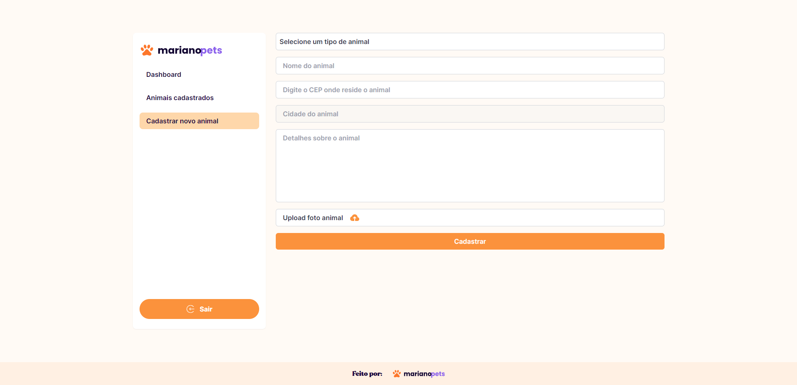

<h1 id="sobre" style="margin-top: 20px; margin-bottom: 20px; text-align: center;"><strong>Mariano Pets - Seu site de adoção</strong></h1>

> Esse é um projeto full-stack criado com o intuito de ser uma aplicação voltada para adoção de animais.🐶




## Começando projeto

Estas instruções irão ajudá-lo a obter uma cópia do projeto completo e executá-lo em sua máquina local para fins de desenvolvimento e teste.

O projeto pode ser construído com npm ou yarn, então escolha uma das abordagens abaixo caso você não tenha nenhum deles instalado em seu sistema.

O Projeto é feito em [NextJs](https://nextjs.org/) então o front-end e o back-end está na mesma aplicação com o back-end sendo encontrado na rota /src/pages/api.
É usado conceitos com ServerSideProps, GetStaticProps e GetStaticPaths, para SEO e geração de site estático, trazendo um carregamento mais rápido das páginas.

<br>

* **Npm** é distribuído juntamente com o Node.js, o que significa que quando você faz o download do Node.js, o npm é automaticamente instalado em seu computador. [Download Node.js](https://nodejs.org/en/download/)

* **Yarn** é um gerenciador de pacotes criado pela equipe do Facebook e parece ser mais rápido que o npm em geral. [Download Yarn](https://yarnpkg.com/en/docs/install)

<br>

## Configuração de Base de dados 

Esse projeto usa:
<br>

[MongoDB](https://www.mongodb.com/atlas/database) - Para registrar dados
<br>

[Firebase](https://firebase.google.com/products/realtime-database/) - Para guardar as imagens 

<br> 

## Como instalar

* Para baixar o projeto, siga as instruções abaixo:

```
1. git clone https://github.com/erosMariano/marianopets.git
2. cd marianopets
```

* Instale as dependências e inicie o servidor:

```
3. yarn install
4. yarn dev
```

ou

```
3. npm install
4. npm dev
```


Renomeie o arquivo `.env.example` para `.env` e crie suas próprias variáveis de ambiente, substituindo-as. Isso é extremamente importante para executar a conexão com os bancos de dados.

<br>

### Features do Projeto

- [x] Home Page
- [x] Página de listagem de animais
- [x] Página do animal
- [x] Popup para contato
- [x] Login - Cookies 
- [x] Dashboard
- [x] Lista dos Animais cadastrados
- [x] Cadastrar novos animais


<br>

## Entre em contato
[Eros Mariano - Linkedin](https://www.linkedin.com/in/erosmariano)


## Telas do Projeto
* Home


* Nossos Pets


* Página Pet


* Informações contato


* Login



* Cadastro


* Dashboard


* Animais Cadastrados



* Cadastrar novo animal



<br>
<br>
<a href="https://blog.rocketseat.com.br/author/thiago/">
 
 <br />
 <sub><b>Eros Mariano</b></sub></a> <a href="https://www.linkedin.com/in/erosmariano/" title="Rocketseat"></a>


Feito com ❤️ por Eros Mariano 👋🏽 Entre em contato!
